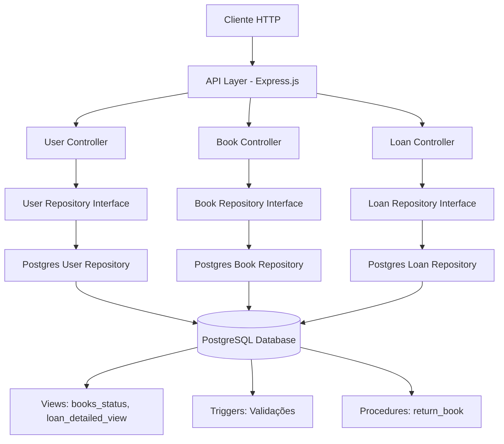
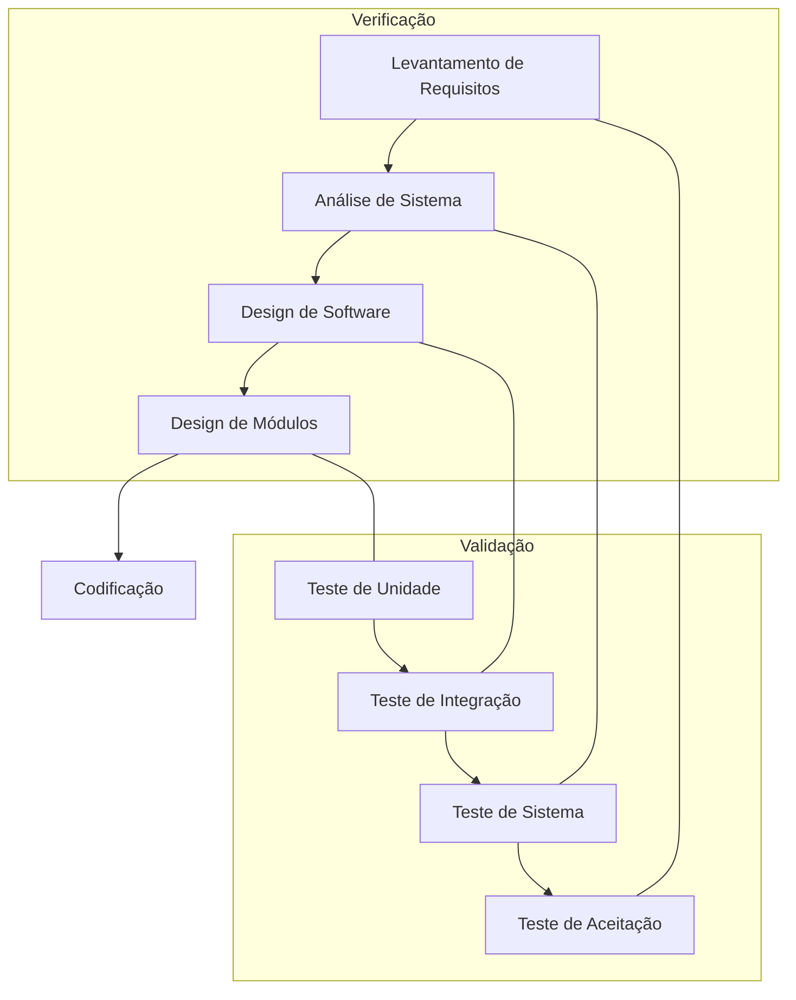

# Análise Técnica do Sistema - API de Gerenciamento de Biblioteca

# 1 Descritivo Funcional do Projeto

O projeto consiste em uma API REST para gerenciamento de biblioteca que permite o controle completo de usuários, livros e empréstimos. O sistema resolve o problema de gestão manual de bibliotecas, automatizando processos de cadastro, empréstimo, devolução e controle de multas.

## 1.1 Visão Geral

O sistema é direcionado para bibliotecas que necessitam de uma solução digital para gerenciar seu acervo e controlar empréstimos. O impacto esperado é a automatização completa dos processos bibliotecários, reduzindo erros manuais e melhorando a eficiência operacional através de validações automáticas e cálculo de multas.

## 1.2 Escopo do Projeto

**O que o sistema faz:**
- Gerenciamento completo de usuários (CRUD)
- Gerenciamento completo de livros (CRUD) 
- Controle de empréstimos e devoluções
- Cálculo automático de multas por atraso
- Controle de status dos livros (disponível/emprestado/atrasado)
- Validações de integridade e regras de negócio
- Relatórios de empréstimos por usuário

**Fora do escopo:**
- Interface gráfica (apenas API)
- Sistema de autenticação/autorização
- Integração com sistemas externos
- Reserva de livros
- Renovação de empréstimos

## 1.3 Requisitos Funcionais

| ID | Requisito | Status | Referência |
|----|-----------|--------|------------|
| RF01 | Cadastrar usuários com validação de email e CPF únicos | ✅ | [acceptance.md - Cadastro de Usuários](../tests/acceptance/acceptance.md#1-gerenciamento-de-usuários) |
| RF02 | Listar e consultar usuários por ID | ✅ | [acceptance.md - Consulta de Usuários](../tests/acceptance/acceptance.md#feature-consulta-de-usuários) |
| RF03 | Excluir usuários (apenas sem empréstimos ativos) | ✅ | [acceptance.md - Exclusão de Usuários](../tests/acceptance/acceptance.md#feature-exclusão-de-usuários) |
| RF04 | Listar empréstimos de um usuário específico | ✅ | [acceptance.md - Consulta de Empréstimos](../tests/acceptance/acceptance.md#feature-consulta-de-empréstimos) |
| RF05 | Cadastrar livros com validação de dados | ✅ | [acceptance.md - Cadastro de Livros](../tests/acceptance/acceptance.md#2-gerenciamento-de-livros) |
| RF06 | Listar livros com status automático | ✅ | [acceptance.md - Consulta de Livros](../tests/acceptance/acceptance.md#feature-consulta-de-livros) |
| RF07 | Buscar livros por título ou ISBN | ✅ | [acceptance.md - Consulta de Livros](../tests/acceptance/acceptance.md#feature-consulta-de-livros) |
| RF08 | Atualizar e excluir livros | ✅ | [acceptance.md - Atualização/Exclusão](../tests/acceptance/acceptance.md#feature-atualização-de-livros) |
| RF09 | Criar empréstimos com validações | ✅ | [acceptance.md - Criação de Empréstimos](../tests/acceptance/acceptance.md#3-gerenciamento-de-empréstimos) |
| RF10 | Listar empréstimos com detalhes completos | ✅ | [acceptance.md - Consulta de Empréstimos](../tests/acceptance/acceptance.md#feature-consulta-de-empréstimos) |
| RF11 | Devolver livros com cálculo de multa | ✅ | [acceptance.md - Devolução de Livros](../tests/acceptance/acceptance.md#feature-devolução-de-livros) |
| RF12 | Calcular status automático dos livros | ✅ | [acceptance.md - Controle de Status](../tests/acceptance/acceptance.md#4-regras-de-negócio) |
| RF13 | Calcular multas por atraso (R$ 1,00/dia) | ✅ | [acceptance.md - Cálculo de Multas](../tests/acceptance/acceptance.md#feature-cálculo-de-multas) |
| RF14 | Validar integridade de dados | ✅ | [acceptance.md - Validações](../tests/acceptance/acceptance.md#feature-validações-de-integridade) |

## 1.4 Requisitos Não Funcionais

- **Desempenho**: API deve responder em menos de 2 segundos
- **Confiabilidade**: Sistema deve estar disponível 99% do tempo
- **Usabilidade**: API RESTful seguindo padrões HTTP
- **Manutenibilidade**: Código TypeScript com arquitetura limpa

---

# 2 Estrutura e Módulos do Sistema

## 2.1 Visão dos Módulos

| Módulo | Descrição |
|--------|-----------|
| **User Module** | Gerenciamento completo de usuários da biblioteca |
| **Book Module** | Controle do catálogo de livros e status |
| **Loan Module** | Gestão de empréstimos e devoluções |
| **Database Module** | Camada de acesso a dados PostgreSQL |
| **API Module** | Controladores REST e roteamento |

## 2.2 Descrição de Cada Módulo

### Módulo 1 – User Module
- **Responsabilidade principal**: Gerenciar usuários da biblioteca
- **Componentes internos**: 
  - `User` (model)
  - `UserController` (REST endpoints)
  - `UserRepository` (interface)
  - `PostgresUserRepository` (implementação)
- **Entradas**: Dados do usuário (name, email, cpf, address)
- **Saídas**: Usuário criado/atualizado, lista de usuários, empréstimos do usuário
- **Principais fluxos**: Validação de email/CPF únicos, verificação de empréstimos ativos antes da exclusão

### Módulo 2 – Book Module
- **Responsabilidade principal**: Controlar catálogo de livros e seus status
- **Componentes internos**:
  - `Book` (model)
  - `BookController` (REST endpoints)
  - `BookRepository` (interface)
  - `PostgresBookRepository` (implementação)
- **Entradas**: Dados do livro (title, author, year, isbn)
- **Saídas**: Livro criado/atualizado, lista de livros com status
- **Principais fluxos**: Cálculo automático de status (available/rented/late), validação de ano e ISBN

### Módulo 3 – Loan Module
- **Responsabilidade principal**: Gerenciar empréstimos e devoluções
- **Componentes internos**:
  - `Loan` (model)
  - `LoanController` (REST endpoints)
  - `LoanRepository` (interface)
  - `PostgresLoanRepository` (implementação)
- **Entradas**: Dados do empréstimo (userId, bookId, startDate, endDate)
- **Saídas**: Empréstimo criado, lista de empréstimos com multas calculadas
- **Principais fluxos**: Validação de disponibilidade do livro, verificação de atrasos do usuário, cálculo de multas

### Módulo 4 – Database Module
- **Responsabilidade principal**: Acesso e persistência de dados
- **Componentes internos**:
  - `client.ts` (configuração PostgreSQL)
  - Views (`books_status`, `loan_detailed_view`)
  - Triggers (validações de integridade)
  - Procedures (devolução de livros)
- **Entradas**: Queries SQL e parâmetros
- **Saídas**: Resultados das consultas
- **Principais fluxos**: Conexão com retry, execução de queries com prepared statements

### Módulo 5 – API Module
- **Responsabilidade principal**: Exposição dos endpoints REST
- **Componentes internos**:
  - `index.ts` (configuração Express)
  - Roteamento HTTP
  - Middleware de erro
  - Health check
- **Entradas**: Requisições HTTP
- **Saídas**: Respostas JSON com status codes apropriados
- **Principais fluxos**: Roteamento, injeção de dependências, tratamento de erros

---

# 3 Arquitetura Geral

## 3.1 Diagrama de Blocos



## 3.2 Fluxo de Dados

1. **Requisição HTTP** chega ao Express.js
2. **Roteamento** direciona para o controller apropriado
3. **Controller** processa a requisição e chama o repository
4. **Repository** executa queries no PostgreSQL
5. **Database** aplica triggers/constraints e retorna dados
6. **Views** calculam campos derivados (status, multas)
7. **Repository** mapeia dados do banco para models
8. **Controller** retorna resposta JSON com status HTTP apropriado

---

# 4 Integrações e Dependências

| Dependência | Versão | Função | Protocolo |
|-------------|--------|--------|-----------|
| **Express.js** | 5.1.0 | Framework web para API REST | HTTP |
| **PostgreSQL** | 15 | Banco de dados relacional | TCP/IP |
| **postgres** | 3.4.7 | Driver PostgreSQL para Node.js | TCP/IP |
| **TypeScript** | 5.6.2 | Tipagem estática | - |
| **Docker** | - | Containerização | - |
| **Bruno** | - | Testes de API | HTTP |

**Integrações Externas**: Nenhuma integração externa implementada.

---

# 5 Segurança

**Status Atual**: Sistema sem autenticação/autorização implementada.

**Medidas de Segurança Implementadas**:
- Proteção contra SQL Injection via prepared statements
- Validação de dados no banco (constraints)
- Sanitização básica de inputs
- Autenticação básica

---

# 6 Testes

## 6.1 Estratégia de Testes - Modelo V

O sistema segue o **Modelo V** de testes, garantindo verificação (desenvolvimento correto) e validação (atendimento aos requisitos):



## 6.2 Ferramentas e Ambientes

| Tipo de Teste | Ferramenta | Status | Finalidade |
|---------------|------------|--------|------------|
| **Unidade** | Jest | ✅ Implementado | Testes isolados de funções/módulos + cobertura |
| **Integração** | Testcontainers | ✅ Implementado | Exercitar contratos e dependências (HTTP/DB) |
| **Sistema (API)** | Bruno CLI | ✅ Implementado | Execução de coleções da API (ponta a ponta via HTTP) |
| **Aceitação** | Gherkin | ✅ Implementado | Validação contra critérios de aceite |


## 6.3 Critérios de Aceitação

✅ **Atendidos**:
- Todos os requisitos possuem pelo menos um caso de teste associado
- 100% dos testes críticos são executados via coleção Bruno
- Evidências de teste registradas na coleção de testes
- Implementação de testes automatizados (Jest)
- Nenhuma falha de alta severidade (não há sistema de classificação implementado)

---

# 7 Estrutura de Diretórios

```
TrabalhoGB/
├── src/
│   ├── application/              # Camada de aplicação
│   │   ├── user/                # Módulo de usuários
│   │   ├── book/                # Módulo de livros
│   │   └── loan/                # Módulo de empréstimos
│   ├── infra/                   # Camada de infraestrutura
│   │   └── postgres/            # Implementações PostgreSQL
│   └── index.ts                 # Ponto de entrada
├── db/                          # Scripts de banco
├── collection/                  # Testes da API
│   └── Library API/             # Coleção Bruno
├── docs/                        # Documentação
├── docker-compose.yml           # Orquestração
├── dockerfile                   # Imagem da aplicação
├── package.json                 # Dependências Node.js
└── tsconfig.json               # Configuração TypeScript
```

# 8 Melhores Práticas

## Design Patterns Implementados

- **Repository Pattern**: Abstração da camada de dados
- **Dependency Injection**: Controllers recebem repositories via construtor
- **Clean Architecture**: Separação clara entre camadas (application/infra)
- **Factory Pattern**: Criação de instâncias dos repositories

## Práticas de Desenvolvimento

- **TypeScript**: Tipagem estática para maior segurança
- **Interfaces**: Contratos bem definidos entre camadas
- **Prepared Statements**: Proteção contra SQL injection
- **Error Handling**: Tratamento centralizado de erros
- **Environment Variables**: Configuração flexível
- **Docker**: Containerização para consistência de ambiente

## Práticas de Banco de Dados

- **Constraints**: Validação de integridade no banco
- **Triggers**: Regras de negócio críticas no banco
- **Views**: Cálculos complexos otimizados
- **Procedures**: Operações atômicas complexas
- **Foreign Keys**: Integridade referencial

## Práticas de Teste

- **Modelo V**: Estrutura de testes alinhada ao desenvolvimento
- **Cenários Gherkin**: Critérios de aceitação claros
- **Testes End-to-End**: Validação completa via API
- **Rastreabilidade**: Vínculo entre requisitos e testes
- **Gestão de Defeitos**: Processo estruturado de correções

## Padrões de Código

- **Naming Convention**: camelCase para variáveis, PascalCase para classes
- **File Organization**: Um arquivo por classe/interface
- **Error Messages**: Mensagens descritivas e códigos específicos
- **HTTP Status Codes**: Uso correto dos códigos de resposta
- **RESTful Design**: Endpoints seguindo padrões REST
- **Test Naming**: Padrão Given-When-Then para clareza
- **Code Coverage**: Mínimo 80% para módulos críticos
